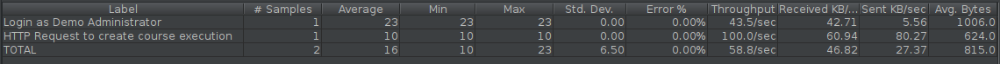
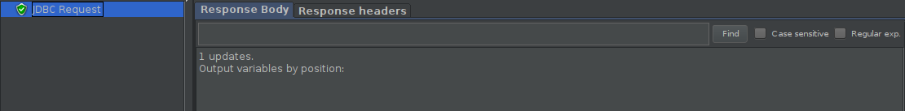
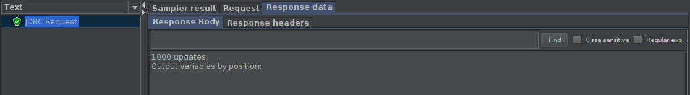

# ES20 P2 submission, Group 45

## Feature PPA

### Subgroup
 - Nome, istID, githubID
   + Issues assigned: [#1](https://github.com), [#3](https://github.com)
 - Nome, istID, githubID
   + Issues assigned: [#2](https://github.com), [#4](https://github.com)
 
### Pull requests associated with this feature

The list of pull requests associated with this feature is:

 - [PR #000](https://github.com)
 - [PR #001](https://github.com)
 - [PR #002](https://github.com)

### Web services definition

#### Controllers
 - [Controller0](https://github.com)
 - [Controller1](https://github.com)

### Feature testing

Each subgroup member defined one reading test and one writing test. The direct links to these are:

 - [ReadingTestJMeter](https://github.com)
 - [WritingTestJMeter](https://github.com)

#### Screenshots of Results Trees and DB cleanup

### Load testing

Each subgroup member defined one reading test and one writing test. The direct links to these are:

 - [ReadingTestJMeter](https://github.com)
 - [WritingTestJMeter](https://github.com)

#### Screenshots of Summary Reports and DB cleanup

### Service profiling

We used the [Async Profiler](https://www.jetbrains.com/help/idea/async-profiler.html).

#### Screenshots of summary reports

#### Discussion of findings

**TODO**: include here a short description of findings (max. 3 sentences). If
you found opportunities for optimization, you can use more than 3 sentences to
describe what you found and how you optimized your code.

---

## Feature DDP

### Subgroup
 - Miguel Mota,90964, UnlimitedPugWorks
   + Issues assigned: [#99](https://github.com/tecnico-softeng/es20tg_45-project/issues/99),[#100](https://github.com/tecnico-softeng/es20tg_45-project/issues/100)
 - Pedro Moreira, 90768, iScaryPT
   + Issues assigned: [#83](https://github.com/tecnico-softeng/es20tg_45-project/issues/83), [#86](https://github.com/tecnico-softeng/es20tg_45-project/issues/86), [#87](https://github.com/tecnico-softeng/es20tg_45-project/issues/87), [#123](https://github.com/tecnico-softeng/es20tg_45-project/issues/123)
 
### Pull requests associated with this feature

The list of pull requests associated with this feature is:

 - [PR #082](https://github.com/tecnico-softeng/es20tg_45-project/pull/82)
 - [PR #091](https://github.com/tecnico-softeng/es20tg_45-project/pull/91)
 - [PR #092](https://github.com/tecnico-softeng/es20tg_45-project/pull/92)

### Web services definition

#### Controllers
 - [Doubt Controller](https://github.com/tecnico-softeng/es20tg_45-project/blob/discuss%C3%A3o-de-perguntas-dev/backend/src/main/java/pt/ulisboa/tecnico/socialsoftware/tutor/doubt/DoubtController.java)
 - [Clarification Controller](https://github.com/tecnico-softeng/es20tg_45-project/blob/discuss%C3%A3o-de-perguntas-dev/backend/src/main/java/pt/ulisboa/tecnico/socialsoftware/tutor/clarification/ClarificationController.java)

### Feature testing

Each subgroup member defined one reading test and one writing test. The direct links to these are:

 - [WSGetStudentDoubtTest - ReadingTestJMeter](https://github.com/tecnico-softeng/es20tg_45-project/blob/discuss%C3%A3o-de-perguntas-dev/backend/jmeter/clarification/WSGetStudentDoubtsTest.jmx)
 - [WSCreateDoubtTest - WritingTestJMeter](https://github.com/tecnico-softeng/es20tg_45-project/blob/discuss%C3%A3o-de-perguntas-dev/backend/jmeter/doubt/WSCreateDoubtTest.jmx)
 - [WSCreateClarificationTest - WritingTestJMeter](https://github.com/tecnico-softeng/es20tg_45-project/blob/discuss%C3%A3o-de-perguntas-dev/backend/jmeter/clarification/WSCreateClarificationTest.jmx)

#### Screenshots of Results Trees and DB cleanup

CreateDoubt

CreateClarification

GetStudentDoubt

### Load testing

Each subgroup member defined one reading test and one writing test. The direct links to these are:

 - [WSGetStudentDoubtsLoadTest - ReadingTestJMeter](https://github.com/tecnico-softeng/es20tg_45-project/blob/discuss%C3%A3o-de-perguntas-dev/backend/jmeter/clarification/WSGetStudentDoubtsLoadTest.jmx)
 - [Load Test Web Service createDoubt - WritingTestJMeter](https://github.com/tecnico-softeng/es20tg_45-project/blob/discuss%C3%A3o-de-perguntas-dev/backend/jmeter/doubt/Load%20Test%20Web%20Service%20createDoubt.jmx)
 - [WSCreateClarificationLoadTest - WritingTestJMeter](https://github.com/tecnico-softeng/es20tg_45-project/blob/discuss%C3%A3o-de-perguntas-dev/backend/jmeter/clarification/WSCreateClarificationLoadTest.jmx)

#### Screenshots of Summary Reports and DB cleanup

CreateDoubt

CreateClarification

GetUserDoubts

### Service profiling

We used the [Java Flight Recorder](https://www.jetbrains.com/help/idea/java-flight-recorder.html).

#### Screenshots of summary reports

CreateDoubt

CreateClarification

GetUserDoubts

#### Discussion of findings

We reached the conclusion that the database, more specifically its service, Hibernate, is responsible for the consumption of most resources.
However, due to the convenience Hibernate gives us, it's not recommended to do any optimization related to Hibernate.

---

## Feature TDP

### Subgroup
 - Nome, istID, githubID
   + Issues assigned: [#1](https://github.com), [#3](https://github.com)
 - Nome, istID, githubID
   + Issues assigned: [#2](https://github.com), [#4](https://github.com)
 
### Pull requests associated with this feature

The list of pull requests associated with this feature is:

 - [PR #000](https://github.com)
 - [PR #001](https://github.com)
 - [PR #002](https://github.com)

### Web services definition

#### Controllers
 - [Controller0](https://github.com)
 - [Controller1](https://github.com)

### Feature testing

Each subgroup member defined one reading test and one writing test. The direct links to these are:

 - [ReadingTestJMeter](https://github.com)
 - [WritingTestJMeter](https://github.com)

#### Screenshots of Results Trees and DB cleanup

### Load testing

Each subgroup member defined one reading test and one writing test. The direct links to these are:

 - [ReadingTestJMeter](https://github.com)
 - [WritingTestJMeter](https://github.com)

#### Screenshots of Summary Reports and DB cleanup

### Service profiling

We used the [Async Profiler](https://www.jetbrains.com/help/idea/async-profiler.html).

#### Screenshots of summary reports

#### Discussion of findings

**TODO**: include here a short description of findings (max. 3 sentences). If
you found opportunities for optimization, you can use more than 3 sentences to
describe what you found and how you optimized your code.

