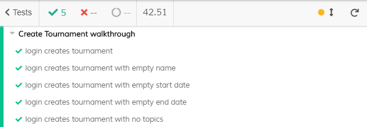
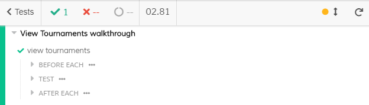
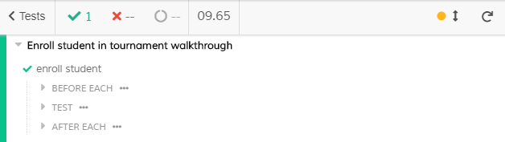

# ES20 P3 submission, Group NN

## Feature PPA

### Subgroup

 - Nome, istID, githubID
   + Issues assigned: [#1](https://github.com), [#3](https://github.com)
 - Nome, istID, githubID
   + Issues assigned: [#2](https://github.com), [#4](https://github.com)
 
### Pull requests associated with this feature

The list of pull requests associated with this feature is:

 - [PR #000](https://github.com)
 - [PR #001](https://github.com)
 - [PR #002](https://github.com)


### Frontend

#### New/Updated Views

 - [View0](https://github.com)
 - [View1](https://github.com)


#### New/Updated Models

 - [Model0](https://github.com)
 - [Model1](https://github.com)

### Additional services implemented

 - [Service 0](https://github.com)
    + [Controller](https://github.com)
    + [Spock tests](https://github.com)
    + [Feature test (JMeter)](https://github.com)

 - [Service 1](https://github.com)
    + [Controller](https://github.com)
    + [Spock tests](https://github.com)
    + [Feature test (JMeter)](https://github.com)


### End-to-end tests

#### Created tests

 - [Login creates and deletes a course execution](https://github.com/socialsoftware/quizzes-tutor/blob/6dcf668498be3d6e45c84ebf61e81b931bdc797b/frontend/tests/e2e/specs/admin/manageCourseExecutions.js#L10)
 - [Login creates two course executions and deletes it](https://github.com/socialsoftware/quizzes-tutor/blob/6dcf668498be3d6e45c84ebf61e81b931bdc797b/frontend/tests/e2e/specs/admin/manageCourseExecutions.js#L16)
 - [Login creates FROM a course execution and deletes it](https://github.com/socialsoftware/quizzes-tutor/blob/6dcf668498be3d6e45c84ebf61e81b931bdc797b/frontend/tests/e2e/specs/admin/manageCourseExecutions.js#L30)

#### Rationale
*TODO*: describe in 100 words (max) the relevance of the end-to-end tests defined with respect to the
common use cases.

#### Commands defined

 - [commands.js](https://github.com/socialsoftware/quizzes-tutor/blob/master/frontend/tests/e2e/support/commands.js)

#### Screenshot of test results overview


---

## Feature DDP

### Subgroup

 - Nome, istID, githubID
   + Issues assigned: [#1](https://github.com), [#3](https://github.com)
 - Nome, istID, githubID
   + Issues assigned: [#2](https://github.com), [#4](https://github.com)
 
### Pull requests associated with this feature

The list of pull requests associated with this feature is:

 - [PR #000](https://github.com)
 - [PR #001](https://github.com)
 - [PR #002](https://github.com)


### Frontend

#### New/Updated Views

 - [View0](https://github.com)
 - [View1](https://github.com)


#### New/Updated Models

 - [Model0](https://github.com)
 - [Model1](https://github.com)

### Additional services implemented

 - [Service 0](https://github.com)
    + [Controller](https://github.com)
    + [Spock tests](https://github.com)
    + [Feature test (JMeter)](https://github.com)

 - [Service 1](https://github.com)
    + [Controller](https://github.com)
    + [Spock tests](https://github.com)
    + [Feature test (JMeter)](https://github.com)


### End-to-end tests

#### Created tests

 - [Login creates and deletes a course execution](https://github.com/socialsoftware/quizzes-tutor/blob/6dcf668498be3d6e45c84ebf61e81b931bdc797b/frontend/tests/e2e/specs/admin/manageCourseExecutions.js#L10)
 - [Login creates two course executions and deletes it](https://github.com/socialsoftware/quizzes-tutor/blob/6dcf668498be3d6e45c84ebf61e81b931bdc797b/frontend/tests/e2e/specs/admin/manageCourseExecutions.js#L16)
 - [Login creates FROM a course execution and deletes it](https://github.com/socialsoftware/quizzes-tutor/blob/6dcf668498be3d6e45c84ebf61e81b931bdc797b/frontend/tests/e2e/specs/admin/manageCourseExecutions.js#L30)

#### Rationale
*TODO*: describe in 100 words (max) the relevance of the end-to-end tests defined with respect to the
common use cases.

#### Commands defined

 - [commands.js](https://github.com/socialsoftware/quizzes-tutor/blob/master/frontend/tests/e2e/support/commands.js)

#### Screenshot of test results overview


---


## Feature TDP

### Subgroup

 - Nuno Palma, 86903, NunoPalma
   + Issues assigned: [#1](https://github.com/tecnico-softeng/es20tg_45-project/issues/139), [#2](https://github.com/tecnico-softeng/es20tg_45-project/issues/140), [#3](https://github.com/tecnico-softeng/es20tg_45-project/issues/141), [#4](https://github.com/tecnico-softeng/es20tg_45-project/issues/142), [#5](https://github.com/tecnico-softeng/es20tg_45-project/issues/162), [#6](https://github.com/tecnico-softeng/es20tg_45-project/issues/170)
 - João Caldeira, 88033, JTCaldeira
   + Issues assigned: [#7](https://github.com/tecnico-softeng/es20tg_45-project/issues/136), [#8](https://github.com/tecnico-softeng/es20tg_45-project/issues/137), [#9](https://github.com/tecnico-softeng/es20tg_45-project/issues/168)
 
### Pull requests associated with this feature

The list of pull requests associated with this feature is:

 - [PR #000](https://github.com/tecnico-softeng/es20tg_45-project/pull/169)
 - [PR #001](https://github.com/tecnico-softeng/es20tg_45-project/pull/138)
 - [PR #002](https://github.com/tecnico-softeng/es20tg_45-project/pull/156)
 - [PR #003](https://github.com/tecnico-softeng/es20tg_45-project/pull/174)
 - [PR #004](https://github.com/tecnico-softeng/es20tg_45-project/pull/176)


### Frontend

#### New/Updated Views

 - [TournamentsView.vue](https://github.com/tecnico-softeng/es20tg_45-project/blob/torneios-de-perguntas/frontend/src/views/student/TournamentsView.vue)
 - [EditTournamentDialog.vue](https://github.com/tecnico-softeng/es20tg_45-project/blob/torneios-de-perguntas/frontend/src/views/student/EditTournamentDialog.vue)


#### New/Updated Models

 - [Tournament.ts](https://github.com/tecnico-softeng/es20tg_45-project/blob/torneios-de-perguntas/frontend/src/models/management/Tournament.ts)

### End-to-end tests

#### Created tests

 - [Login creates tournament](https://github.com/tecnico-softeng/es20tg_45-project/blob/torneios-de-perguntas/frontend/tests/e2e/specs/tournament/createTournament.js)
 - [Login views tournaments list](https://github.com/tecnico-softeng/es20tg_45-project/blob/torneios-de-perguntas/frontend/tests/e2e/specs/tournament/viewTournamentsList.js)
 - [Login enroll student in tournament](https://github.com/tecnico-softeng/es20tg_45-project/blob/torneios-de-perguntas/frontend/tests/e2e/specs/tournament/enrollStudent.js)

#### Rationale
* ```createTournament:``` The first test is a successful case of a tournament creation, with all valid input. The other 4 tests each provide a different invalid input, upon whose receival an error should be thrown.
* ```viewTournamentsLost:``` Successful case where the user tries to access the tournaments page and views the list of available tournaments.
* ```enrollStudent:``` Successful case where the user tries to enroll in a certain tournament.


#### Commands defined

 - [commands.js](https://github.com/tecnico-softeng/es20tg_45-project/blob/torneios-de-perguntas/frontend/tests/e2e/support/commands.js)

#### Screenshot of test results overview



