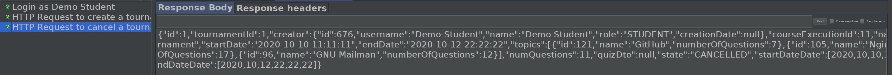
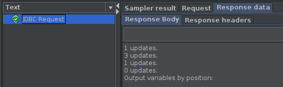
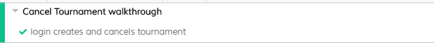

# ES20 P4 submission, Group NN

## Feature PPA

### Subgroup

 - Nome, istID, githubID
   + Issues assigned: [#1](https://github.com), [#3](https://github.com)
   + Tasks: F1:Service, F1:Spock Tests, etc
 - Nome, istID, githubID
   + Issues assigned: [#2](https://github.com), [#4](https://github.com)
   + Tasks: F2:Service, F2:Spock Tests, etc
 
### Pull requests associated with this feature

The list of pull requests associated with this feature is:

 - [PR #000](https://github.com)
 - [PR #001](https://github.com)
 - [PR #002](https://github.com)

### Listed features

Below, we list **only** the implemented features. For each feature, we link the relevant files and we mark which are requested parts are completed.

#### Feature number 1: _Uma questão aprovada pode passar a fazer parte do conjunto de perguntas disponíveis_

 - [x] [Service](https://github.com)
 - [x] [Spock tests](https://github.com)
 - [x] [JMeter feature tests](https://github.com)
   + Screenshots:
      
     
     
 - [x] [Cypress use case test](https://github.com)
   + Screenshot: 
   
     

#### Feature number N: **TODO**

 - [x] [Service](https://github.com)
 - [x] [Spock tests](https://github.com)
 - [ ] [JMeter feature test](https://github.com)
 - [ ] [Cypress use case test](https://github.com)

### Additional features

**TODO**: if you have implemented additional features, describe them here (following the same format as above).

---

## Feature DDP

### Subgroup

 - Nome, istID, githubID
   + Issues assigned: [#1](https://github.com), [#3](https://github.com)
   + Tasks: F1:Service, F1:Spock Tests, etc
 - Nome, istID, githubID
   + Issues assigned: [#2](https://github.com), [#4](https://github.com)
   + Tasks: F2:Service, F2:Spock Tests, etc
 
### Pull requests associated with this feature

The list of pull requests associated with this feature is:

 - [PR #000](https://github.com)
 - [PR #001](https://github.com)
 - [PR #002](https://github.com)

### Listed features

Below, we list **only** the implemented features. For each feature, we link the relevant files and we mark which are requested parts are completed.

#### Feature number 1: _O aluno pode pedir esclarecimentos adicionais_

 - [x] [Service](https://github.com)
 - [x] [Spock tests](https://github.com)
 - [x] [JMeter feature tests](https://github.com)
   + Screenshots:
      
     
     
 - [x] [Cypress use case test](https://github.com)
   + Screenshot: 
   
     

#### Feature number N: **TODO**

 - [x] [Service](https://github.com)
 - [x] [Spock tests](https://github.com)
 - [ ] [JMeter feature test](https://github.com)
 - [ ] [Cypress use case test](https://github.com)

### Additional features

**TODO**: if you have implemented additional features, describe them here (following the same format as above).

---

## Feature TDP

### Subgroup

 - Nuno Palma, ist186903, NunoPalma
   + Issues assigned: [#251](https://github.com/tecnico-softeng/es20tg_45-project/issues/251), [#252](https://github.com/tecnico-softeng/es20tg_45-project/issues/252), [#253](https://github.com/tecnico-softeng/es20tg_45-project/issues/253), [#254](https://github.com/tecnico-softeng/es20tg_45-project/issues/254), [#255](https://github.com/tecnico-softeng/es20tg_45-project/issues/255), [#257](https://github.com/tecnico-softeng/es20tg_45-project/issues/257), [#222](https://github.com/tecnico-softeng/es20tg_45-project/issues/222), [#221](https://github.com/tecnico-softeng/es20tg_45-project/issues/221), [#218](https://github.com/tecnico-softeng/es20tg_45-project/issues/218), [#276](https://github.com/tecnico-softeng/es20tg_45-project/issues/276)
   + Tasks: F6:Define Spock Tests, F6:Implement Spock Tests, F6:Service, F7:Define Spock Tests, F7:Implement Spock Tests, F7:Service, F7:Define Web Service, F7:Define Routing and Page, F7:Implement page
 - João Caldeira, ist188033, JTCaldeira
   + Issues assigned: [#220](https://github.com/tecnico-softeng/es20tg_45-project/issues/220), [#224](https://github.com/tecnico-softeng/es20tg_45-project/issues/224), [#227](https://github.com/tecnico-softeng/es20tg_45-project/issues/227), [#228](https://github.com/tecnico-softeng/es20tg_45-project/issues/228), [#240](https://github.com/tecnico-softeng/es20tg_45-project/issues/240), [#241](https://github.com/tecnico-softeng/es20tg_45-project/issues/240), [#242](https://github.com/tecnico-softeng/es20tg_45-project/issues/242), [#243](https://github.com/tecnico-softeng/es20tg_45-project/issues/243), [#244](https://github.com/tecnico-softeng/es20tg_45-project/issues/244), [#267](https://github.com/tecnico-softeng/es20tg_45-project/issues/267), [#268](https://github.com/tecnico-softeng/es20tg_45-project/issues/268), [#269](https://github.com/tecnico-softeng/es20tg_45-project/issues/269)
   + Tasks: F4:Define Spock Tests, F4:Implement Spock Tests, F4:Service, F4:Refactor Service, F4:Define Routing and Page, F4:Implement Page, F4:Implement Web Tests, F5:Define Spock Tests, F5:Implement Spock Tests, F5:Implement functionality, F5:Refactor Functionality and Tests
 
### Pull requests associated with this feature

The list of pull requests associated with this feature is:

 - [PR #000](https://github.com)
 - [PR #001](https://github.com)
 - [PR #002](https://github.com)

### Listed features

Below, we list **only** the implemented features. For each feature, we link the relevant files and we mark which are requested parts are completed.

#### Feature number 4: _O aluno que criou o torneio pode cancelá-lo_

 - [x] [Service](https://github.com/tecnico-softeng/es20tg_45-project/blob/torneios-de-perguntas-dev/backend/src/main/java/pt/ulisboa/tecnico/socialsoftware/tutor/tournament/TournamentService.java)
 - [x] [Spock tests](https://github.com/tecnico-softeng/es20tg_45-project/blob/torneios-de-perguntas-dev/backend/src/test/groovy/pt/ulisboa/tecnico/socialsoftware/tutor/tournament/service/CancelTournamentServiceSpockTest.groovy)
 - [x] [JMeter feature tests](https://github.com/tecnico-softeng/es20tg_45-project/blob/torneios-de-perguntas-dev/backend/jmeter/tournament/WSCancelTournamentTest.jmx)
   + Screenshots:
      
     
     
     
 - [x] [Cypress use case test](https://github.com/tecnico-softeng/es20tg_45-project/blob/torneios-de-perguntas-dev/frontend/tests/e2e/specs/tournament/cancelTournament.js)
   + Screenshot: 
   
     

#### Feature number 5: _Se o número de alunos inscritos, incluindo o criador do torneio, for superior a 1, o sistema gera o quiz associado ao torneio_

 - [x] [Service](https://github.com/tecnico-softeng/es20tg_45-project/blob/torneios-de-perguntas/backend/src/main/java/pt/ulisboa/tecnico/socialsoftware/tutor/tournament/TournamentService.java#L127)
 - [x] [Spock tests](https://github.com/tecnico-softeng/es20tg_45-project/blob/torneios-de-perguntas/backend/src/test/groovy/pt/ulisboa/tecnico/socialsoftware/tutor/tournament/service/CreateAssociatedQuizSpockTest.groovy)

#### Feature number 6: _Os alunos participantes respondem às perguntas no período definido para o torneio_

 - [x] [Service](https://github.com/tecnico-softeng/es20tg_45-project/blob/torneios-de-perguntas-dev/backend/src/main/java/pt/ulisboa/tecnico/socialsoftware/tutor/tournament/TournamentService.java#L119)
 - [x] [Spock tests](https://github.com/tecnico-softeng/es20tg_45-project/blob/torneios-de-perguntas-dev/backend/src/test/groovy/pt/ulisboa/tecnico/socialsoftware/tutor/tournament/service/EnrollStudentTimeConstraintServiceSpockTest.groovy)
     

#### Feature number 7: _Existe um dashboard do aluno onde é apresentada informação acerca dos torneios em que participou e qual a sua pontuação_

 - [x] [Service](https://github.com/tecnico-softeng/es20tg_45-project/blob/torneios-de-perguntas-dev/backend/src/main/java/pt/ulisboa/tecnico/socialsoftware/tutor/tournament/TournamentController.java#L43)
 - [x] [Spock tests](https://github.com/tecnico-softeng/es20tg_45-project/blob/torneios-de-perguntas-dev/backend/src/test/groovy/pt/ulisboa/tecnico/socialsoftware/tutor/tournament/service/GetStudentTournamentStatsServiceSpockTest.groovy)
    
---