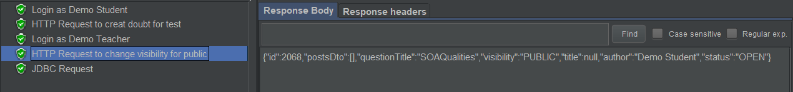
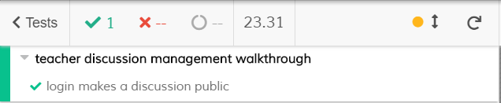
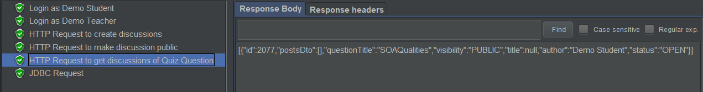
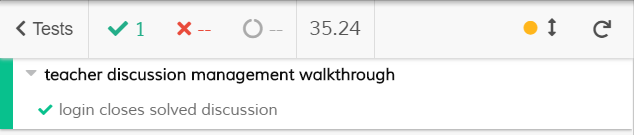

# ES20 P4 submission, Group 45

## Feature PPA

### Subgroup

 - Nome, istID, githubID
   + Issues assigned: [#1](https://github.com), [#3](https://github.com)
   + Tasks: F1:Service, F1:Spock Tests, etc
 - Nome, istID, githubID
   + Issues assigned: [#2](https://github.com), [#4](https://github.com)
   + Tasks: F2:Service, F2:Spock Tests, etc
 
### Pull requests associated with this feature

The list of pull requests associated with this feature is:

 - [PR #000](https://github.com)
 - [PR #001](https://github.com)
 - [PR #002](https://github.com)

### Listed features

Below, we list **only** the implemented features. For each feature, we link the relevant files and we mark which are requested parts are completed.

#### Feature number 1: _Uma questão aprovada pode passar a fazer parte do conjunto de perguntas disponíveis_

 - [x] [Service](https://github.com)
 - [x] [Spock tests](https://github.com)
 - [x] [JMeter feature tests](https://github.com)
   + Screenshots:
      
     
     
 - [x] [Cypress use case test](https://github.com)
   + Screenshot: 
   
     

#### Feature number N: **TODO**

 - [x] [Service](https://github.com)
 - [x] [Spock tests](https://github.com)
 - [ ] [JMeter feature test](https://github.com)
 - [ ] [Cypress use case test](https://github.com)

### Additional features

**TODO**: if you have implemented additional features, describe them here (following the same format as above).

---

## Feature DDP

### Subgroup

 - Pedro Moreira, 90768, iScaryPT
   + Issues assigned: 
   [#210](https://github.com/tecnico-softeng/es20tg_45-project/issues/210)
   [#212](https://github.com/tecnico-softeng/es20tg_45-project/issues/212)
   [#213](https://github.com/tecnico-softeng/es20tg_45-project/issues/213)
   [#214](https://github.com/tecnico-softeng/es20tg_45-project/issues/214)
   [#215](https://github.com/tecnico-softeng/es20tg_45-project/issues/215)
   [#218](https://github.com/tecnico-softeng/es20tg_45-project/issues/218)
   [#226](https://github.com/tecnico-softeng/es20tg_45-project/issues/226)
   [#230](https://github.com/tecnico-softeng/es20tg_45-project/issues/230)
   [#238](https://github.com/tecnico-softeng/es20tg_45-project/issues/238)
   [#245](https://github.com/tecnico-softeng/es20tg_45-project/issues/245)
   [#246](https://github.com/tecnico-softeng/es20tg_45-project/issues/246)
   [#247](https://github.com/tecnico-softeng/es20tg_45-project/issues/247)
   [#262](https://github.com/tecnico-softeng/es20tg_45-project/issues/262)
   [#263](https://github.com/tecnico-softeng/es20tg_45-project/issues/263)
   [#264](https://github.com/tecnico-softeng/es20tg_45-project/issues/264)
   [#265](https://github.com/tecnico-softeng/es20tg_45-project/issues/265)
   [#266](https://github.com/tecnico-softeng/es20tg_45-project/issues/266)
   + Tasks: F1: FrontEnd Tests, F1:FrontEnd Page, F1:Web Service, F1:Jmeter Test,
   F2: FrontEnd Page, F2: Web Service, F2:Service, F2: Spock Tests,  F2:Jmeter Test
   F3: Jmeter Test,
   F6: FrontEnd Tests, F6: Jmeter Test, F6: Web Service,  F6:FrontEnd Page, F6: Service

   
  
 - Miguel Mota, 90964, UnlimitedPugWorks
   + Issues assigned:
   [#208](https://github.com/tecnico-softeng/es20tg_45-project/issues/208) ,
   [#237](https://github.com/tecnico-softeng/es20tg_45-project/issues/237),
   [#249](https://github.com/tecnico-softeng/es20tg_45-project/issues/249),
   [#260](https://github.com/tecnico-softeng/es20tg_45-project/issues/260),
   [#261](https://github.com/tecnico-softeng/es20tg_45-project/issues/261),
   [#270](https://github.com/tecnico-softeng/es20tg_45-project/issues/270),
   [#271](https://github.com/tecnico-softeng/es20tg_45-project/issues/271) 
   [#272](https://github.com/tecnico-softeng/es20tg_45-project/issues/272)
   [#273](https://github.com/tecnico-softeng/es20tg_45-project/issues/273)
   [#274](https://github.com/tecnico-softeng/es20tg_45-project/issues/274)
   [#275](https://github.com/tecnico-softeng/es20tg_45-project/issues/275)
   + Tasks: 
            F1:Refactor,
            F3:FrontEnd Page,
            F4:Routing, F4: FrontEnd Page,
            F5:Spock Test, F5:Service, F5:Web Service, F5:FrontEnd Page,
            F6:Spock Tests
            
 
### Pull requests associated with this feature

The list of pull requests associated with this feature is:

 - [PR #000](https://github.com)

### Listed features

#### Feature number 1: O aluno pode pedir esclarecimentos adicionais_

 - [x] [Service](https://github.com/tecnico-softeng/es20tg_45-project/blob/discuss%C3%A3o-de-perguntas/backend/src/main/java/pt/ulisboa/tecnico/socialsoftware/tutor/doubt/DoubtService.java)
 - [x] [Spock tests](https://github.com/tecnico-softeng/es20tg_45-project/blob/discuss%C3%A3o-de-perguntas/backend/src/test/groovy/pt/ulisboa/tecnico/socialsoftware/tutor/doubt/service/AddDoubtTest.groovy)
 - [x] [JMeter feature tests](https://github.com/tecnico-softeng/es20tg_45-project/blob/discuss%C3%A3o-de-perguntas/backend/jmeter/doubt/WSaddDoubtDiscussionTest.jmx)
   + Screenshots:
      
     
     
 - [x] [Cypress use case test](https://github.com/tecnico-softeng/es20tg_45-project/blob/discuss%C3%A3o-de-perguntas/frontend/tests/e2e/specs/student/addAdditionalDoubttoDiscussion.js)
   + Screenshot: 
   
     

#### Feature number 2: O Docente pode tornar a questão e o seu esclarecimento disponivel para os outros alunos.

 - [x] [Service](https://github.com/tecnico-softeng/es20tg_45-project/blob/discuss%C3%A3o-de-perguntas/backend/src/main/java/pt/ulisboa/tecnico/socialsoftware/tutor/doubt/DoubtService.java)
 - [x] [Spock tests](https://github.com/tecnico-softeng/es20tg_45-project/blob/discuss%C3%A3o-de-perguntas/backend/src/test/groovy/pt/ulisboa/tecnico/socialsoftware/tutor/doubt/service/changeVisibilityTest.groovy)
 - [x] [JMeter feature tests](https://github.com/tecnico-softeng/es20tg_45-project/blob/discuss%C3%A3o-de-perguntas/backend/jmeter/doubt/WSchangeVisibilityTest.jmx)
   + Screenshots:
      
     
     
 - [x] [Cypress use case test](https://github.com/tecnico-softeng/es20tg_45-project/blob/discuss%C3%A3o-de-perguntas/frontend/tests/e2e/specs/teacher/changeDiscussionVisibility.js)
   + Screenshot: 
   
     

#### Feature number 3: Um aluno, após responder a uma pergunta, pode consultar, se existirem os pedidos de esclarecimento sobre essa pergunta e as repostas dadas

 - [x] [Service](https://github.com/tecnico-softeng/es20tg_45-project/blob/discuss%C3%A3o-de-perguntas/backend/src/main/java/pt/ulisboa/tecnico/socialsoftware/tutor/doubt/DoubtService.java)
 - [x] [Spock tests](https://github.com/tecnico-softeng/es20tg_45-project/blob/discuss%C3%A3o-de-perguntas/backend/src/test/groovy/pt/ulisboa/tecnico/socialsoftware/tutor/doubt/service/GetQuizQuestionDiscussionTest.groovy)
 - [x] [JMeter feature tests](https://github.com/tecnico-softeng/es20tg_45-project/blob/discuss%C3%A3o-de-perguntas/backend/jmeter/doubt/WSGetQuizQuestionDiscussionsTest.jmx)
    + Screenshot: 
         
 - [x] [Cypress use case test](https://github.com/tecnico-softeng/es20tg_45-project/blob/discuss%C3%A3o-de-perguntas/frontend/tests/e2e/specs/student/manageQuizAnswerDiscussions.js)

#### Feature number 4: Existe um Dashboard do aluno aonde é apresentada informação acerca de quantos pedidos de esclarecimento efetou e quantos lhe foram creditados.

 - [x] [Service](https://github.com/tecnico-softeng/es20tg_45-project/blob/discuss%C3%A3o-de-perguntas/backend/src/main/java/pt/ulisboa/tecnico/socialsoftware/tutor/doubt/DoubtService.java)
 - [x] [Spock tests](https://github.com/tecnico-softeng/es20tg_45-project/blob/discuss%C3%A3o-de-perguntas/backend/src/test/groovy/pt/ulisboa/tecnico/socialsoftware/tutor/doubt/service/GetUserDiscussionListTest.groovy)
 - [x] [JMeter feature tests](https://github.com/tecnico-softeng/es20tg_45-project/blob/discuss%C3%A3o-de-perguntas/backend/jmeter/doubt/WSGetStudentDiscussionsTest.jmxhttps://github.com/tecnico-softeng/es20tg_45-project/blob/discuss%C3%A3o-de-perguntas/backend/jmeter/doubt/WSGetStudentDiscussionsTest.jmx)
   + Screenshots:
      
     
     
 - [ ] [Cypress use case test](https://github.com)

#### Feature number 5: O aluno decide se esta informação no seu dashboard deve ser publica ou privada.

 - [x] [Service](https://github.com/tecnico-softeng/es20tg_45-project/blob/discuss%C3%A3o-de-perguntas/backend/src/main/java/pt/ulisboa/tecnico/socialsoftware/tutor/doubt/DoubtService.java)
 - [x] [Spock tests](https://github.com/tecnico-softeng/es20tg_45-project/blob/discuss%C3%A3o-de-perguntas/backend/src/test/groovy/pt/ulisboa/tecnico/socialsoftware/tutor/doubt/service/GetUserDiscussionListTest.groovy)
 - [x] [JMeter feature tests](https://github.com/tecnico-softeng/es20tg_45-project/blob/discuss%C3%A3o-de-perguntas/backend/jmeter/doubt/WSGetStudentDiscussionsTest.jmx)
   + Screenshots:
      
     
     
 - [ ] [Cypress use case test](https://github.com)

### Additional features
#### Feature number 6: Um professor pode fechar uma discussão, impedido que ela seja reaberta e que o aluno possa pedir mais esclarecimentos.
 - [x] [Service](https://github.com/tecnico-softeng/es20tg_45-project/blob/discuss%C3%A3o-de-perguntas/backend/src/main/java/pt/ulisboa/tecnico/socialsoftware/tutor/doubt/DoubtService.java)
 - [x] [Spock tests](https://github.com/tecnico-softeng/es20tg_45-project/blob/discuss%C3%A3o-de-perguntas/backend/src/test/groovy/pt/ulisboa/tecnico/socialsoftware/tutor/doubt/service/closeDiscussionTest.groovy)
 - [x] [JMeter feature tests](https://github.com/tecnico-softeng/es20tg_45-project/blob/discuss%C3%A3o-de-perguntas/backend/jmeter/doubt/WScloseDiscussion.jmx)
   + Screenshots:
      
     
     
 - [x] [Cypress use case test](https://github.com/tecnico-softeng/es20tg_45-project/blob/discuss%C3%A3o-de-perguntas/frontend/tests/e2e/specs/teacher/closeDiscussion.jsm)
   + Screenshot: 
   
     

---

## Feature TDP

### Subgroup

 - Nome, istID, githubID
   + Issues assigned: [#1](https://github.com), [#3](https://github.com)
   + Tasks: F1:Service, F1:Spock Tests, etc
 - Nome, istID, githubID
   + Issues assigned: [#2](https://github.com), [#4](https://github.com)
   + Tasks: F2:Service, F2:Spock Tests, etc
 
### Pull requests associated with this feature

The list of pull requests associated with this feature is:

 - [PR #000](https://github.com)
 - [PR #001](https://github.com)
 - [PR #002](https://github.com)

### Listed features

Below, we list **only** the implemented features. For each feature, we link the relevant files and we mark which are requested parts are completed.

#### Feature number 1: _Se o número de alunos inscritos, incluindo o criador do torneio, for superior a 1, o sistema gera o quiz associado ao torneio_

 - [x] [Service](https://github.com)
 - [x] [Spock tests](https://github.com)
 - [x] [JMeter feature tests](https://github.com)
   + Screenshots:
      
     
     
 - [x] [Cypress use case test](https://github.com)
   + Screenshot: 
   
     

#### Feature number N: **TODO**

 - [x] [Service](https://github.com)
 - [x] [Spock tests](https://github.com)
 - [ ] [JMeter feature test](https://github.com)
 - [ ] [Cypress use case test](https://github.com)

### Additional features

**TODO**: if you have implemented additional features, describe them here (following the same format as above).

---